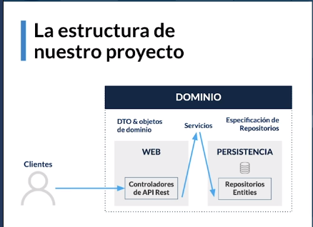
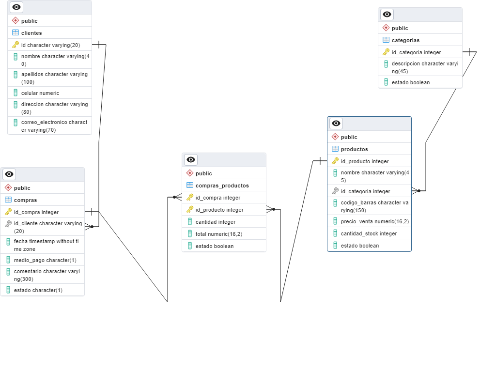

# Desarrollo de una API con el Frameword springboot
## Propiedades de la Aplicación
- `aplication.properties, application.yml` o linea  de comado: Este archivo nos permite gestionar la cnfiguración que tiene el proyecto, por ejeplo mdificar el puerto por donde se ejecuta o el content path de nuestra aplicación
- Posibilidad de añadir propiedades propias como varaible para la configuración
- Gestión de perfiles segun el tipo de despligue, de acuerdo al entorno donde se encuentra nuestro proyecto, podemos crear un perfil que se ejecuta en tiempo de desarrollo y otro perfil que se enfoque en tiempo de producción
    - Para agregar el path del proyecto
        `server.servlet.context-path=/platz-market/api`
    - En archivo `application.property` indicamos con que perfil podemos trabajar utilizando la siguiente instrucción
        `spring.profiles.active=dev`, es decir la palabra que está después del guion 
## Estructura arquitectónica de nuestra aplicación

Es por capas orientada al dominio
- `La primera Capa es la de Dominio` en donde vamos a tener `DTO y objetos de dominios` hacen parte del contexto de nuestra aplicación es decir hacen parte del contexto de un supermercado. Vamos a tener los `servicios` van ha servir de puentes entre los controladores de la API y la capa de persistencia o el repositorio es quien interviene con la base de datos. Tambien vamos a tener la `Específicación de Repositorios` son intefaces o contratatos que debe cumplir la persistencia para intervenir los objetos de dominio y la base de datos
- `La Segunda capa es la WEB`, vamos a tener los controladores de nuestra API 
- Por último vamos a tener la `capa de persistencia` es la que interactúa con la BD

      

## Que es JPA?
- Es una especificación de java(un estandar) para un framework ORM. Es una serie de reglas que java define para que cualquier framework que quiera interactuar en la BD desde java tiene que seguir
- Interactuar con las tablas de BD en forma de objeto Java.
- Algunas de  sus implementaciones son
    - Hibernate  
    - TopLink
    - EclipseLink
    - ObjectDB
- Para este fin JPA utiliza Anotaciones para conectar a tablas de la BD
    - @Entity
    - @Table
    - @Column
    - @Id & @EmbededID
    - @GeneratedValue
    - @OneToMany & @ManyToOne

## Spring Data
- Spring Data NO es una implementacion de JPA, sino mas bien es un proyecto que usa JPA para ofrecer funcionalidaes extra en la gestion de tareas desde JAVA a las base de datos.
- Spring Data internamente tiene varios subproyectos, entre ellos: Spring Data JPA y Spring Data JDBC, para conectarnos a BD relacionales (SQL). Spring Data MongoDB y Spring Data Cassandra, son proyectos para conectarnos a BD no relacionales.
- La tarea principal de Spring Data es optimizar tareas repitivas.
- Spring data nos provee de respositorios sin codigo, nos permiten hacer todo tipo de operaciones en BD (CRUD) sin utilizar una linea de código.
- También nos provee de auditorías transparentes, por ello, posee un motor de auditorias que nos permite saber cuando se insertó un registro, cuando se borró, cuando se actualizo en la BD, etc.
<h3>Implementación en el proyecto Market.</h3>
Se busca en MAVEN el repositorio Spring Boot Starter Data JPA, se copia el group y el name en las dependencias del archivo build.gradle de nuestro proyecto quedando de la siguiente manera.

```
dependencies {
    //Dependencia agregada
    implementation 'org.springframework.boot:spring-boot-starter-data-jpa'

    implementation 'org.springframework.boot:spring-boot-starter-web'
    testImplementation('org.springframework.boot:spring-boot-starter-test') {
    exclude group: 'org.junit.vintage', module: 'junit-vintage-engine'
    }
}
```
## Modelo Relacional del Proyecto Market platzi

  
